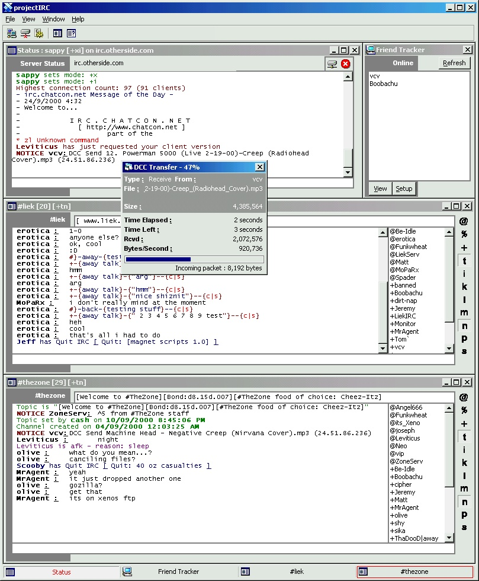



## projectIRC build 47 \(with DCC Receive \[supports resume\]\)

### Description

Update to my IRC Client. It now allows you to receive DCC transfer, and resume them. I'm working on DCC Send and chat still. Now handles channel CTCPs. Also has buttons in the channel toolbar for each mode, as seen in the screen shot. Rejoin on kick. Other small changes and bug fixes. Speed has been slightly improved.

Please rate the code and leave feedback :)
 
### More Info
 

             |
---                |---
**Submitted On**   |2000-10-09 21:11:04
**By**             |[vcv](https://github.com/Planet-Source-Code/PSCIndex/blob/master/ByAuthor/vcv.md)
**Level**          |Advanced
**User Rating**    |4.8 (58 globes from 12 users)
**Compatibility**  |VB 6\.0
**Category**       |[Complete Applications](https://github.com/Planet-Source-Code/PSCIndex/blob/master/ByCategory/complete-applications__1-27.md)
**World**          |[Visual Basic](https://github.com/Planet-Source-Code/PSCIndex/blob/master/ByWorld/visual-basic.md)
**Archive File**   |[CODE\_UPLOAD105511092000\.zip](https://github.com/Planet-Source-Code/vcv-projectirc-build-47-with-dcc-receive-supports-resume__1-11972/archive/master.zip)

